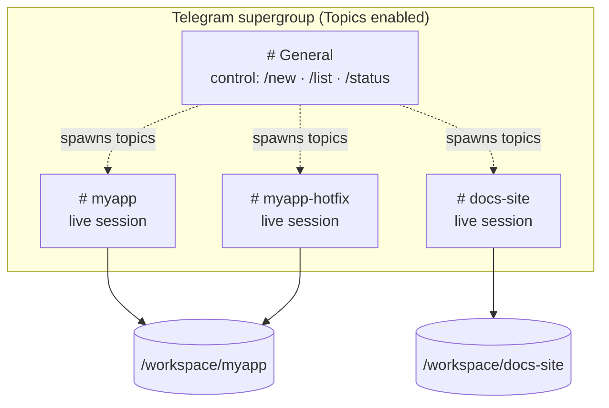
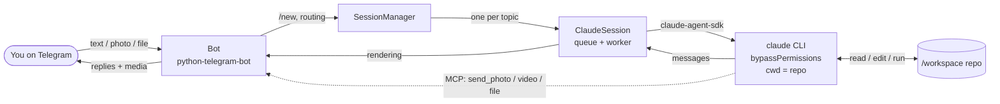
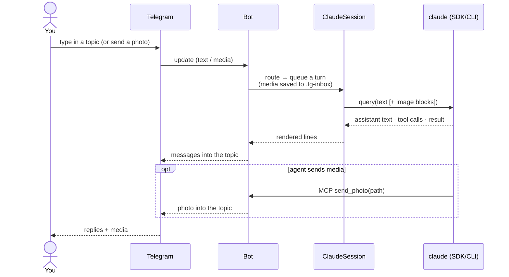

# telegram-agentic-session-manager

Control **parallel [Claude Code](https://www.claude.com/product/claude-code)
sessions from Telegram — one live session per forum topic.** Kick off and talk to
real coding sessions from your phone, run several at once across different repos,
and manage them independently. No orchestrator layer: a message in a topic is that
Claude session's next turn.

Think of it as a self-hosted, no-lock-in alternative to hosted "control your agent
from your phone" tools — you own the bot, the box, and the data.

## The model

- **One Telegram supergroup** (with Topics enabled) is your control surface.
- **The General topic** is the control plane: `/new`, `/list`, `/status`.
- **Every other topic = exactly one live Claude Code session**, bound to a working
  directory. What you type in a topic is sent verbatim to that session; its output
  streams back into the same topic.
- One repo can back **several** topics → parallel lines of work on one codebase.
- Sessions run headless with `bypassPermissions` (there's no terminal to answer
  prompts). Each session's ID is persisted, so a bot restart **resumes** every
  session with full context.



Two topics can point at the **same** repo (`myapp` + `myapp-hotfix`) — parallel,
independent sessions on one codebase.

## Features

- **1 topic ⇄ 1 session**, many in parallel, each isolated.
- **Full media, both directions** — send photos/files/video *to* a session (images
  become vision input; everything lands in `./.tg-inbox/`), and the agent can send
  photos/video/documents/messages *back* via built-in tools (see
  [Media & agent tools](#media--agent-tools)).
- **Resumable** across restarts (persisted session IDs; lazily reconnected).
- **Runs anywhere Docker does**, always-on via `restart: unless-stopped`.
- **Container-isolated** so `bypassPermissions` only reaches the repos you mount.
- **Batteries-included image** — sessions can build/run most projects and
  `apt`/`npm`/`pip` install whatever else they need.
- **Environment-aware sessions** — each session is told it's headless on a possibly
  bind-mounted FS, so it prefers one-shot builds over hot-reload and reports
  environment quirks instead of confabulating around them.
- Configurable bot persona (`BOT_NAME`), user allowlist, per-session working dirs.

## How it works



A single user turn, end to end:



Sessions are driven by the official
[`claude-agent-sdk`](https://code.claude.com/docs/en/agent-sdk/overview), which
runs the standalone `claude` CLI. Turns are serialized per topic (a Claude session
is inherently one turn at a time). See [AGENTS.md](AGENTS.md) for internals.

## Requirements

- **Docker** (recommended) — or Python ≥ 3.11 + [uv](https://docs.astral.sh/uv/)
  for local runs.
- A **Claude Code** login. The SDK drives the standalone CLI; in Docker the image
  installs it, and auth is supplied by mounting your `~/.claude` (see
  [Auth](#auth)).

## Quickstart

### 1. Create and configure the bot

1. **Create the bot:** [@BotFather](https://t.me/BotFather) → `/newbot` → copy the token.
2. **Create a supergroup**, open its settings → enable **Topics**.
3. **Add the bot as an Admin** with **Manage Topics** permission. (Admins receive
   all messages, so you do *not* need to touch BotFather's privacy mode.)
4. **Get your numeric user ID** from [@userinfobot](https://t.me/userinfobot) — or
   start the bot and DM it `/whoami`.

### 2. Configure

```bash
cp .env.example .env
```

Fill in at minimum:

| Variable | Required | Meaning |
|---|---|---|
| `TELEGRAM_BOT_TOKEN` | ✅ | BotFather token |
| `TELEGRAM_ALLOWED_USER_IDS` | ✅ | Comma-separated user IDs allowed to command the bot |
| `HOST_DOCUMENTS` | ✅ (Docker) | Host path to your projects, mounted as `/workspace` |
| `HOST_CLAUDE_DIR` | ✅ (Docker) | Host path to your `~/.claude`, mounted for auth |
| `BOT_NAME` | – | Display persona (default `Session Manager`) |
| `TELEGRAM_CHAT_ID` | – | Pin the bot to one group (logged on first run) |
| `CLAUDE_MODEL`, `CLAUDE_MAX_TURNS` | – | Session tuning |

Use forward slashes in paths on all platforms (Windows: `C:/Users/You/Documents`).

### 3. Run

**Docker (always-on, recommended):**

```bash
docker compose up -d --build
docker compose logs -f          # watch it come online
```

It auto-restarts on crash or host reboot. Compose mounts `HOST_DOCUMENTS` →
`/workspace` and sets `PROJECTS_ROOT=/workspace`, so `/new myapp` targets
`/workspace/myapp`.

**Local (dev):**

```bash
uv sync
uv run tasm
```

### 4. Use it

In **General**:

| Command | Effect |
|---|---|
| `/new <path> [name]` | Create a topic + session in `<path>` (relative to `PROJECTS_ROOT`, or absolute) |
| `/list` | List sessions and their status |
| `/status` | Bot health |
| `/whoami` | Show your Telegram id + the chat id (handy while filling in the allowlist) |

In a **session topic**:

| Command | Effect |
|---|---|
| *(any message)* | Sent to that session as its next turn |
| *(a photo / file / video)* | Downloaded to `./.tg-inbox/` and given to the session (images also as vision input) |
| `/stop` | Interrupt the current turn |
| `/kill` | End the session and close the topic |

## Media & agent tools

**You → session.** Send a photo, document, video, animation, audio, or voice note
into a topic (optionally with a caption). The bot downloads it, saves it under
`<repo>/.tg-inbox/`, and hands it to the session. Images are additionally attached
as **vision input** so Claude can see them. (Telegram bots can fetch files up to
20 MB.)

**Session → you.** Each session gets in-process tools it can call to push content
back into its own topic:

| Tool | Sends |
|---|---|
| `mcp__telegram__send_photo(path, caption?)` | an image, rendered inline |
| `mcp__telegram__send_video(path, caption?)` | a video |
| `mcp__telegram__send_file(path, caption?)` | any file, as a document |
| `mcp__telegram__send_message(text)` | an extra text message |

So you can ask a session to "screenshot the page and send it to me", "render the
chart and send the PNG", or "build the report and send me the PDF" — and it will.
Sends are confined to the session's workspace; uploads up to 50 MB.

## Auth

Sessions authenticate as your Claude account. Two options:

- **Quick-start (default):** mount your host `~/.claude` (compose does this). The
  container reuses your existing login and persists session history for resume.
  Trade-off: host and container share one credential.
- **Cleaner for a server:** `claude setup-token` mints a long-lived, revocable
  token — drop the `~/.claude` mount and pass the token to the container instead.
  Recommended if the box is shared or exposed. This also limits blast radius if a
  session is ever prompt-injected.

## Security

**Please read [SECURITY.md](SECURITY.md).** In short: the **allowlist** and the
**container boundary** are what keep `bypassPermissions` safe. The bot ignores
anyone not in `TELEGRAM_ALLOWED_USER_IDS` and refuses to start with an empty list.
Sessions can only touch what you mount (`/workspace`), not the rest of your host.

## Caveats

- **Bind-mount performance (esp. Windows/macOS).** Reads/writes are reliable but
  file-*watching* (inotify) may not fire across the VM boundary — hot-reload dev
  servers can lag or miss changes. Fine for edit/commit/build/test; sessions are
  told to prefer one-shot commands.
- **Toolchain.** The image covers common stacks (node, python, git, ffmpeg,
  ripgrep, …). For anything exotic, sessions can install it at runtime (ephemeral)
  or you add it to the [Dockerfile](Dockerfile) to persist it.

## Development

```bash
uv sync
uv run tasm            # run
```

Layout:

```
src/tasm/
  __main__.py       entrypoint
  config.py         env-backed settings
  store.py          persistent topic <-> session map
  claude_session.py one live ClaudeSDKClient per topic
  manager.py        create / route / resume / kill
  rendering.py      SDK messages -> Telegram (pure, testable)
  telegram_bot.py   handlers + emitter
```

Contributions welcome — keep session output as plain text (Telegram entity parsing
is fragile) and verify SDK field names against the installed `claude-agent-sdk`.

## License

[MIT](LICENSE).
