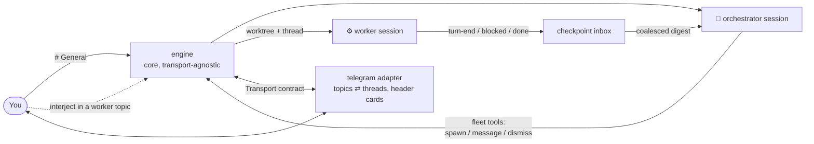
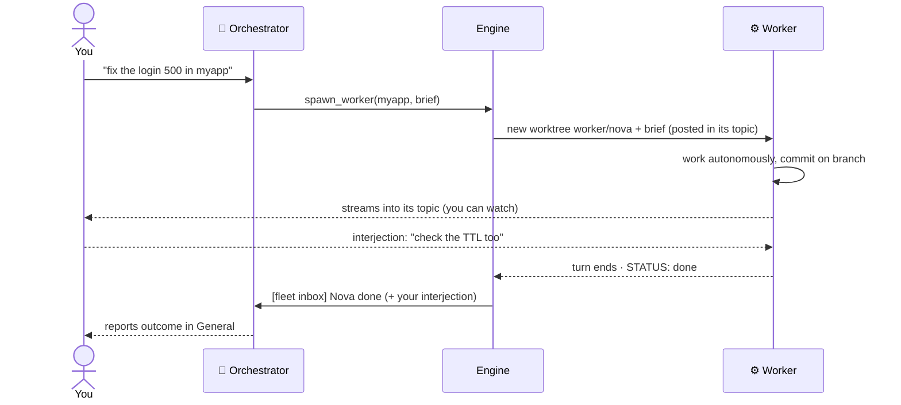

<p align="center">
  
</p>

<p align="center">
  <a href="docs/">Docs</a> ·
  <a href="docs/concepts.md">Concepts</a> ·
  <a href="docs/behaviour.md">Behaviour</a> ·
  <a href="docs/extending.md">Extending</a> ·
  <a href="docs/architecture.md">Architecture</a>
</p>

**Run your own agent org.** You're the boss: you talk to an **orchestrator** agent,
and it hires **worker** agents for your tasks, briefs them, and supervises — while
you watch every agent-to-agent conversation and can step into any of them. Each
worker runs in an isolated git worktree, so parallel work never collides.
Self-hosted, on your box.

be-a-boss is a **framework**, and deliberately modular: the org logic is a
transport-agnostic, backend-agnostic core. The **surface** you drive it from and
the **agent backend** your workers run on are both pluggable adapters — nothing in
the core knows which one it's talking to.

| | Supported now | Next |
|---|---|---|
| **Surface** — how you drive it | Telegram | Web / VS Code · Slack |
| **Agent backend** — what workers run | Claude Code | Codex |

The guide below uses the Telegram + Claude Code combo (today's supported pair);
swapping either is an adapter, not a rewrite.

## The model


- **General topic = the orchestrator's office.** Give it goals in plain language
  ("fix the login 500 in myapp, then audit deps"). It splits the work, hires
  workers, briefs them, supervises at checkpoints, and reports outcomes.
- **Every worker gets its own topic** named after it (`⚙️ Nova · myapp`). The
  orchestrator's instructions and the worker's work stream into that topic live —
  you literally watch the manager drive the worker.
- **You can interject in any worker topic.** Your message reaches the worker as
  input *and* the orchestrator's inbox — both see it, like walking up to a desk.
- **Isolated worktrees.** Each worker works on its own branch (`worker/<name>`) in
  its own git worktree — same-repo parallelism is safe; work survives on the
  branch after the worker is dismissed. Dirty worktrees are never deleted.
- **Direct sessions still exist**: `/new <path>` gives you a classic
  1-topic-=-1-session thread with no orchestrator in between — perfect for quick
  hands-on work.
- Everything is headless (`bypassPermissions`), resumable across restarts, and
  runs always-on in Docker.

One Telegram bot token carries all identities — speakers are rendered as header
cards (🧭 orchestrator / ⚙️ worker name) since a bot account can't change its
sender per message.

## Features

- **Orchestrator + team** — talk to one agent; it hires, briefs, and supervises
  workers. Or go direct with `/new`.
- **Glass-walled delegation** — every worker conversation is a visible topic you
  can watch and interject into; both agents see your message.
- **Isolated git worktrees** — each worker on its own `worker/<name>` branch;
  parallel same-repo work never collides, and un-landed work is never deleted.
- **Checkpoint supervision** — workers run autonomously; the orchestrator is woken
  only at meaningful checkpoints (done / blocked / needs-decision / interjection),
  never per token. Wakes are coalesced to save tokens.
- **Full media, both directions** — send photos/files/video *to* a session (images
  become vision input; everything lands in `./.tg-inbox/`), and any session can
  send photos/video/documents/messages *back* (see [Media & agent tools](#media--agent-tools)).
- **Resumable** across restarts, **always-on** in Docker, **container-isolated**,
  **batteries-included image** (node/python/git/ffmpeg/chromium; agents can
  install more).
- **Transport-agnostic core** — the engine (`core/`) speaks in `Speaker`/`Event`
  abstractions; Telegram is one adapter in `transports/`. Slack/VSCode = new
  adapters, zero core changes.

## How it works



A delegated task, end to end:



Sessions are driven by the official
[`claude-agent-sdk`](https://code.claude.com/docs/en/agent-sdk/overview) running
the standalone `claude` CLI. See **[docs/architecture.md](docs/architecture.md)**
for the full design and [AGENTS.md](AGENTS.md) for internals.

## Requirements

- **Docker** (recommended) — or Python ≥ 3.11 + [uv](https://docs.astral.sh/uv/)
  for local runs.
- A **Claude Code** login. The SDK drives the standalone CLI; in Docker the image
  installs it, and auth is supplied by mounting your `~/.claude` (see
  [Auth](#auth)).

## Quickstart

### 1. Create and configure the bot

1. **Create the bot:** [@BotFather](https://t.me/BotFather) → `/newbot` → copy the token.
2. **Create a supergroup**, open its settings → enable **Topics**.
3. **Add the bot as an Admin** with **Manage Topics** permission. (Admins receive
   all messages, so you do *not* need to touch BotFather's privacy mode.)
4. **Get your numeric user ID** from [@userinfobot](https://t.me/userinfobot) — or
   start the bot and DM it `/whoami`.

### 2. Configure

```bash
cp .env.example .env
```

Fill in at minimum:

| Variable | Required | Meaning |
|---|---|---|
| `TELEGRAM_BOT_TOKEN` | ✅ | BotFather token |
| `TELEGRAM_ALLOWED_USER_IDS` | ✅ | Comma-separated user IDs allowed to command the bot |
| `HOST_DOCUMENTS` | ✅ (Docker) | Host path to your projects, mounted as `/workspace` |
| `HOST_CLAUDE_DIR` | ✅ (Docker) | Host path to your `~/.claude`, mounted for auth |
| `BOT_NAME` | – | Display persona (default `Orchestrator`) |
| `TELEGRAM_CHAT_ID` | – | Pin the bot to one group (logged on first run) |
| `CLAUDE_MODEL`, `CLAUDE_MAX_TURNS` | – | Session tuning |

Use forward slashes in paths on all platforms (Windows: `C:/Users/You/Documents`).

### 3. Run

**Docker (always-on, recommended):**

```bash
docker compose up -d --build
docker compose logs -f          # watch it come online
```

It auto-restarts on crash or host reboot. Compose mounts `HOST_DOCUMENTS` →
`/workspace` and sets `PROJECTS_ROOT=/workspace`, so `/new myapp` targets
`/workspace/myapp`.

**Local (dev):**

```bash
uv sync
uv run boss
```

### 4. Use it

**Just talk to the orchestrator in General** — plain language, no command:

> *"In myapp, reproduce the /login 500 and patch it. Separately, audit the deps in
> docs-site for anything unmaintained."*

It hires workers (one per task), opens a topic for each, briefs them, and reports
back. Open a worker's topic to watch the work; type there to steer.

Commands in **General**:

| Command | Effect |
|---|---|
| *(plain message)* | A goal for the orchestrator |
| `/new <path> [name]` | A **direct** session (no orchestrator) in `<path>` |
| `/list` | All threads (orchestrator, workers, direct) + status |
| `/status` | Bot health |
| `/whoami` | Your Telegram id + the chat id (handy for the allowlist) |

In any **session/worker topic**:

| Command | Effect |
|---|---|
| *(any message)* | Sent to that session; in a worker topic the orchestrator sees it too |
| *(a photo / file / video)* | Saved to `./.tg-inbox/` and handed to the session (images also as vision) |
| `/stop` | Interrupt the current turn |
| `/kill` | End the session (a worker's clean worktree is removed; dirty ones kept) |

## Media & agent tools

**You → session.** Send a photo, document, video, animation, audio, or voice note
into a topic (optionally with a caption). The bot downloads it, saves it under
`<repo>/.tg-inbox/`, and hands it to the session. Images are additionally attached
as **vision input** so Claude can see them. (Telegram bots can fetch files up to
20 MB.)

**Session → you.** Each session gets in-process tools it can call to push content
back into its own topic:

| Tool | Sends |
|---|---|
| `mcp__chat__send_photo(path, caption?)` | an image, rendered inline |
| `mcp__chat__send_video(path, caption?)` | a video |
| `mcp__chat__send_file(path, caption?)` | any file, as a document |
| `mcp__chat__send_message(text)` | an extra text message |

So you can ask a session to "screenshot the page and send it to me", "render the
chart and send the PNG", or "build the report and send me the PDF" — and it will.
Sends are confined to the session's workspace; uploads up to 50 MB.

## Auth

Sessions authenticate as your Claude account. Two options:

- **Quick-start (default):** mount your host `~/.claude` (compose does this). The
  container reuses your existing login and persists session history for resume.
  Trade-off: host and container share one credential.
- **Cleaner for a server:** `claude setup-token` mints a long-lived, revocable
  token — drop the `~/.claude` mount and pass the token to the container instead.
  Recommended if the box is shared or exposed. This also limits blast radius if a
  session is ever prompt-injected.

## Security

**Please read [SECURITY.md](SECURITY.md).** In short: the **allowlist** and the
**container boundary** are what keep `bypassPermissions` safe. The bot ignores
anyone not in `TELEGRAM_ALLOWED_USER_IDS` and refuses to start with an empty list.
Sessions can only touch what you mount (`/workspace`), not the rest of your host.

## Caveats

- **Bind-mount performance (esp. Windows/macOS).** Reads/writes are reliable but
  file-*watching* (inotify) may not fire across the VM boundary — hot-reload dev
  servers can lag or miss changes. Fine for edit/commit/build/test; sessions are
  told to prefer one-shot commands.
- **Toolchain.** The image covers common stacks (node, python, git, ffmpeg,
  ripgrep, …). For anything exotic, sessions can install it at runtime (ephemeral)
  or you add it to the [Dockerfile](Dockerfile) to persist it.

## Development

```bash
uv sync
uv run boss            # run
```

Layout (core is transport-agnostic; adapters live in `transports/`):

```
src/beaboss/
  __main__.py            entrypoint (config → engine → telegram → poll)
  config.py              env-backed settings
  rendering.py           SDK message → text (pure, testable)
  core/
    ports.py             Transport / Speaker / Outbound / Inbound contracts
    session.py           CoreSession — one Claude session, posts via a callback
    engine.py            Engine — orchestrator, fleet tools, checkpoint inbox
    worktrees.py         isolated git worktrees (fail-closed teardown)
    store.py             restart-proof thread/fleet state
    names.py             worker name pool
  transports/
    telegram.py          topics ⇄ threads, header-card identities, commands
```

Adding a transport = implement `core.ports.Transport` and feed the engine
`InboundMessage`s. Nothing in `core/` may import a chat platform.

Contributions welcome — keep session output plain text (chat entity parsing is
fragile) and verify SDK field names against the installed `claude-agent-sdk`.
See **[docs/architecture.md](docs/architecture.md)**.

## License

[MIT](LICENSE).
