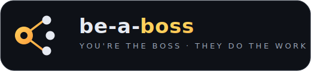
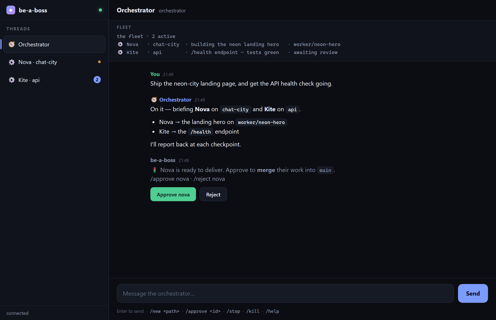
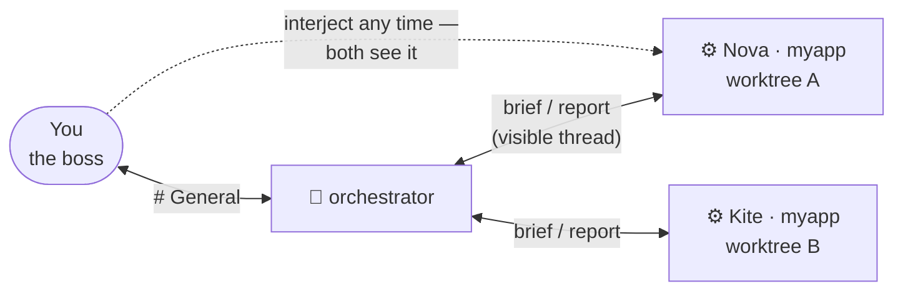
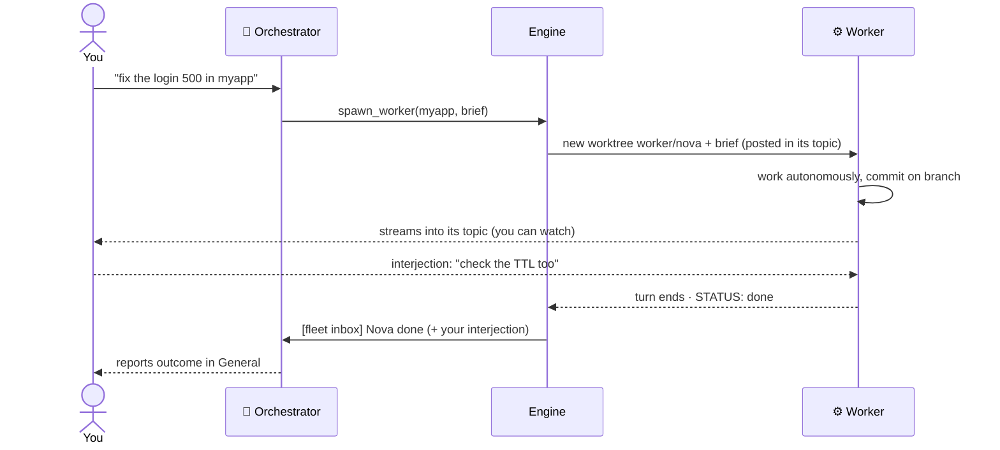
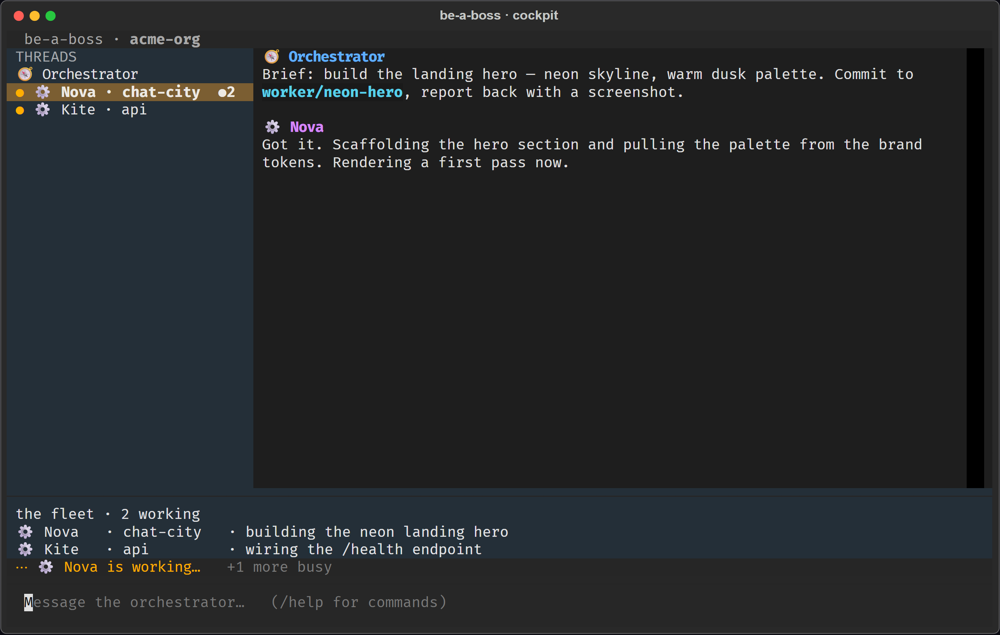

<p align="center">
  
</p>

<p align="center">
  <a href="docs/">Docs</a> ·
  <a href="docs/concepts.md">Concepts</a> ·
  <a href="docs/behaviour.md">Behaviour</a> ·
  <a href="docs/extending.md">Extending</a> ·
  <a href="docs/architecture.md">Architecture</a>
</p>

<p align="center">
  <a href="https://github.com/Dri-water/be-a-boss/releases/download/v0.1.0/BeABoss.mp4">
    
  </a>
</p>
<p align="center"><em>▶︎ <a href="https://github.com/Dri-water/be-a-boss/releases/download/v0.1.0/BeABoss.mp4">Watch with sound (43s)</a></em></p>

**Run your own agent org.** You're the boss: you talk to an **orchestrator** agent,
and it hires **worker** agents for your tasks, briefs them, and supervises — while
you watch every agent-to-agent conversation and can step into any of them. Each
worker runs in an isolated git worktree, so parallel work never collides.
Self-hosted, on your box.

be-a-boss is a **framework**, and deliberately modular: the org logic is a
transport-agnostic, backend-agnostic core. The **surface** you drive it from and
the **agent backend** your workers run on are both pluggable adapters — nothing in
the core knows which one it's talking to.

| | Supported now | Next |
|---|---|---|
| **Surface** — how you drive it | Telegram · **Web** (`python -m beaboss.web`) · **CLI / TUI** (`boss-cli`) | Slack · your own UI over the shared protocol |
| **Agent backend** — what workers run | Claude Code · **Codex** (`BEABOSS_BACKEND=codex`) | — |

The quickstart below covers **all three** surfaces; the orchestrator + workers
underneath are identical either way — swapping a surface or backend is an adapter,
not a rewrite. That's the whole point of the core. The CLI even ships an
agent-drivable `--json` mode (drive the whole org from a pipe) and a self-assembling
terminal cockpit (`pip install be-a-boss[tui]`).

<p align="center">
  
</p>
</p>

## The model



- **Talk to the orchestrator in #general or by DM.** Same one orchestrator either
  way — it just replies wherever you spoke, so a DM keeps small talk (a button-colour
  tweak) out of #general. Give it goals in plain language ("fix the login 500 in
  myapp, then audit deps"). It splits the work, hires workers, briefs them, supervises
  at checkpoints, and reports outcomes.
- **#general is a live status board** — a single pinned message, always current,
  showing what's running, what's blocked, and what's awaiting your `/approve`. It's
  code-rendered from state, not chatter.
- **Every worker gets its own topic** named after it (`⚙️ Nova · myapp`); the
  orchestrator's instructions and the worker's work stream into that topic live —
  you literally watch the manager drive the worker.
- **You can interject in any worker topic.** Your message reaches the worker as
  input *and* the orchestrator's inbox — both see it, like walking up to a desk.
- **Isolated worktrees.** Each worker works on its own branch (`worker/<name>`) in
  its own git worktree — same-repo parallelism is safe; work survives on the
  branch after the worker is dismissed. Dirty worktrees are never deleted.
- **Direct sessions still exist**: `/new <path>` gives you a classic
  1-topic-=-1-session thread with no orchestrator in between — perfect for quick
  hands-on work.
- Everything is headless (`bypassPermissions`), resumable across restarts, and
  runs always-on in Docker.

One Telegram bot token carries all identities — speakers are rendered as header
cards (🧭 orchestrator / ⚙️ worker name) since a bot account can't change its
sender per message.

## Features

- **Orchestrator + team** — talk to one agent; it hires, briefs, and supervises
  workers. Or go direct with `/new`.
- **Glass-walled delegation** — every worker conversation is a visible topic you
  can watch and interject into; both agents see your message.
- **Isolated git worktrees** — each worker on its own `worker/<name>` branch;
  parallel same-repo work never collides, and un-landed work is never deleted.
- **Delivery, not dead-ends** — a finished worker's branch doesn't just sit there:
  the orchestrator shows you the diff and lands it — a deterministic local **merge**,
  or a **PR** (`gh pr create`) when you've set up a remote + `GH_TOKEN`. How landing
  is authorized is your call (`DEPLOY_BRAVENESS`): **balanced** (default) lets the
  orchestrator land on your clear say-so ("merge it"); **conservative** requires an
  explicit `/approve`. A failed `run_checks` blocks delivery in both.
- **Checkpoint supervision** — workers run autonomously; the orchestrator is woken
  only at meaningful checkpoints (done / blocked / needs-decision / interjection),
  never per token. Wakes are coalesced to save tokens.
- **Full media, both directions** — send photos/files/video *to* a session (images
  the model reads — PNG/JPEG/GIF/WebP — become vision input; everything lands in
  `./.beaboss-inbox/`), and any session can
  send photos/video/documents/messages *back* (see [Media & agent tools](#media--agent-tools)).
- **Resumable** across restarts, **always-on** in Docker, **container-isolated**,
  **batteries-included image** (node/python/git/ffmpeg/chromium; agents can
  install more).
- **Transport-agnostic core** — the engine (`core/`) speaks in `Speaker`/`Outbound`
  abstractions; Telegram and a WebSocket surface (the web app) are adapters in
  `transports/`. Slack is the next adapter — zero core changes.

## How it works


A delegated task, end to end:



Worker sessions run on your chosen backend — by default the official
[`claude-agent-sdk`](https://code.claude.com/docs/en/agent-sdk/overview) driving
the standalone `claude` CLI, or the Codex CLI with `BEABOSS_BACKEND=codex`. See
**[docs/architecture.md](docs/architecture.md)** for the full design and
[AGENTS.md](AGENTS.md) for internals.

## Requirements

- **Docker** (recommended) — or Python ≥ 3.11 + [uv](https://docs.astral.sh/uv/)
  for local runs.
- A **Claude Code** login. The SDK drives the standalone CLI; in Docker the image
  installs it, and auth is supplied by mounting your `~/.claude` (see
  [Auth](#auth)).

## Quickstart

**Pick a surface** — the orchestrator + workers underneath are identical on each:

- **Web** — fastest to try: no accounts, nothing to register, runs on
  your box. **Start here** if you just want to see it work.
- **CLI / TUI** — a terminal cockpit (`boss-cli`), and an agent-drivable `--json`
  mode so a script or another agent can run the whole org from a pipe.
- **Telegram** — an always-on bot you reach from your phone; its group topics
  become your agent threads. A few minutes of one-time setup.

### Prerequisites (all surfaces)

- **A [Claude Code](https://code.claude.com/docs/en/agent-sdk/overview) login** —
  workers run real agent sessions as you. (Prefer Codex? Set `BEABOSS_BACKEND=codex`.)
- **Python ≥ 3.11 + [uv](https://docs.astral.sh/uv/)** for local runs, **or Docker**
  for the always-on Telegram bot.

```bash
git clone https://github.com/Dri-water/be-a-boss.git
cd be-a-boss && uv sync
```

### Option A — Web (no Telegram)

Start the server (binds to localhost only), then open a UI against it:

```bash
uv run python -m beaboss.web        # serves the UI + WebSocket on http://127.0.0.1:8765
```

On start it prints a one-time **connect URL with a token** (`http://…/?token=…`) —
the same port serves the app shell over HTTP and the WebSocket, so there's no
`file://` juggling. That token is required to open the socket, and every connection
is also checked for a same-origin `Origin`, so a random web page you visit can't
reach your local server (CSWSH). Set `WEB_TOKEN` to pin a stable token instead of a
fresh one each run.

- **Browser** — open the printed `http://…/?token=…` URL; it connects and drops you
  in the orchestrator's thread. Type a goal.

Two layers guard this surface: the **localhost bind** (a public bind is refused
unless you set `WEB_ALLOW_INSECURE_BIND=1` and front it with your own auth) **and**
the per-connection **token + Origin check** above — so even other processes/pages on
your own machine can't drive it. Reach a remote box over an SSH tunnel. Set
`PROJECTS_ROOT` if you want bare project names to resolve somewhere other than your
home dir. (Change the bind with `WEB_HOST` / `WEB_PORT`; default `127.0.0.1:8765`.)

### Option B — CLI / TUI (no Telegram, no browser)

Drive the org straight from a terminal:

```bash
uv run python -m beaboss.cli          # or:  boss-cli
```

By default (a real terminal) it opens the **cockpit** — a TUI that assembles itself
as work happens (`pip install "be-a-boss[tui]"` for it; falls back to a plain
coloured stream otherwise).

<p align="center">
  
</p>

Two more modes:

- `--json` — newline-delimited JSON events on stdout, commands on stdin. This is how
  **an agent or script drives the whole org** — the same event shapes the web surface
  speaks. `echo '{"type":"message","thread_id":"general","text":"..."}' | boss-cli --json`
- `--plain` — a simple coloured line stream (good for logs / dumb terminals).

Set `PROJECTS_ROOT` / `STATE_DIR` as for the web surface. No token needed — the CLI
runs locally, gated by who can run a process on the host.

### Option C — Telegram (always-on bot)

1. **Create the bot:** [@BotFather](https://t.me/BotFather) → `/newbot` → copy the
   token. **Add it as an Admin** (with **Manage Topics**) of a **supergroup that has
   Topics enabled**. (Admins receive all messages — no need to touch privacy mode.)
2. **Configure:** `cp .env.example .env`, set `TELEGRAM_BOT_TOKEN` and (for Docker)
   `HOST_DOCUMENTS` + `HOST_CLAUDE_DIR`. Leave `TELEGRAM_ALLOWED_USER_IDS` **blank**
   for now.
3. **Run it** — with no allowlist yet, it starts in **setup mode** (only `/whoami`
   works, everything else is ignored):

   ```bash
   docker compose up -d --build     # always-on, auto-restarts;  or, for dev:  uv run boss
   ```

4. **DM the bot `/whoami`.** It replies with your numeric id — this works *before*
   you're allowlisted, which is the whole point of setup mode. Put that id in
   `TELEGRAM_ALLOWED_USER_IDS`, restart, and you're the boss. No third-party bot needed.

| Variable | Needed | Meaning |
|---|---|---|
| `TELEGRAM_BOT_TOKEN` | ✅ | BotFather token |
| `TELEGRAM_ALLOWED_USER_IDS` | after setup | Ids allowed to command the bot (blank ⇒ setup mode) |
| `HOST_DOCUMENTS` | ✅ (Docker) | Host path to your projects, mounted as `/workspace` |
| `HOST_CLAUDE_DIR` | ✅ (Docker) | Host path to your `~/.claude`, mounted for auth |
| `BOT_NAME` | – | Display persona (default `Orchestrator`) |
| `TELEGRAM_CHAT_ID` | – | Pin the bot to one group (logged on first run) |
| `DEPLOY_BRAVENESS` | – | How work lands: `balanced` (default; orchestrator merges on your say-so) or `conservative` (explicit `/approve` only) |
| `AGENT_MODEL`, `AGENT_MAX_TURNS` | – | Backend-neutral session tuning (override per backend with `CLAUDE_*` / `CODEX_*`) |

Docker mounts `HOST_DOCUMENTS` → `/workspace` and sets `PROJECTS_ROOT=/workspace`,
so `/new myapp` targets `/workspace/myapp`. Use forward slashes on all platforms
(Windows: `C:/Users/You/Documents`).

### Use it

**Talk to the orchestrator** — in Telegram's **General** topic, or the first thread
of the web UI — plain language, no command:

> *"In myapp, reproduce the /login 500 and patch it. Separately, audit the deps in
> docs-site for anything unmaintained."*

It hires workers (one per task), opens a thread for each, briefs them, and reports
back. Open a worker's thread to watch the work; type there to steer.

Don't read the web surface as a lesser view: the web cockpit speaks the same
slash-commands (below), renders markdown, turns the 🚦 delivery prompt into one-click
**Approve / Reject** buttons, and takes attachments by 📎, drag-and-drop, or clipboard
paste. The commands below work on Telegram, the web cockpit, and the CLI.

Commands in **General**:

| Command | Effect |
|---|---|
| *(plain message)* | A goal for the orchestrator |
| `/approve <id>` · `/reject <id>` | Land or decline a worker's delivery (needed in `conservative` mode) |
| `/new <path> [name]` | A **direct** session (no orchestrator) in `<path>` |
| `/list` | All threads (orchestrator, workers, direct) + status |
| `/status` | Bot health |
| `/setup` | Check the group is configured right |
| `/reset` | Factory reset — wipe all memory, state, and the on-screen conversation (asks to confirm) |
| `/whoami` | Your Telegram id + the chat id (handy for the allowlist) |

In any **session/worker topic**:

| Command | Effect |
|---|---|
| *(any message)* | Sent to that session; in a worker topic the orchestrator sees it too |
| *(a photo / file / video)* | Saved to `./.beaboss-inbox/` and handed to the session (images also as vision) |
| `/stop` | Interrupt the current turn |
| `/kill` | End the session (a worker's clean worktree is removed; dirty ones kept) |

## Media & agent tools

**You → session.** Send a photo, document, video, animation, audio, or voice note
into a thread (optionally with a caption) — on Telegram as an attachment, or in the
**web cockpit** via the 📎 button, drag-and-drop, or pasting an image straight from
the clipboard. It's saved under `<repo>/.beaboss-inbox/` and handed to the session;
images in a model-supported format (PNG/JPEG/GIF/WebP) are additionally attached as
**vision input** so the agent can see them — other images are still saved as files it
can open by path. (Telegram fetches files up to 20 MB; the web accepts up to 8 MB per
file, 10 MB per message.)

**Session → you.** Each session gets in-process tools it can call to push content
back into its own topic:

| Tool | Sends |
|---|---|
| `mcp__chat__send_photo(path, caption?)` | an image, rendered inline |
| `mcp__chat__send_video(path, caption?)` | a video |
| `mcp__chat__send_file(path, caption?)` | any file, as a document |
| `mcp__chat__send_message(text)` | an extra text message |

So you can ask a session to "screenshot the page and send it to me", "render the
chart and send the PNG", or "build the report and send me the PDF" — and it will.
Sends are confined to the session's workspace; uploads up to 50 MB.

## Auth

Sessions authenticate as your Claude account. Two options:

- **Quick-start (default):** mount your host `~/.claude` (compose does this). The
  container reuses your existing login and persists session history for resume.
  Trade-off: host and container share one credential.
- **Cleaner for a server:** `claude setup-token` mints a long-lived, revocable
  token — drop the `~/.claude` mount and pass the token to the container instead.
  Recommended if the box is shared or exposed. This also limits blast radius if a
  session is ever prompt-injected.

## Security

**Please read [SECURITY.md](SECURITY.md).** In short, what keeps `bypassPermissions`
safe is the **boundary around each surface** plus the **container**. The Telegram bot
ignores anyone not in `TELEGRAM_ALLOWED_USER_IDS`; with an empty allowlist it runs in
**setup mode** — only `/whoami` works, everything else is refused — so it is never
open-to-all. The web surface binds to **localhost**, refuses a public bind
unless you explicitly opt in (`WEB_ALLOW_INSECURE_BIND=1`), and requires a
per-connection **token + same-origin check** so nothing else on the machine can drive
it. Worker subprocesses run with the bot's own secrets (`TELEGRAM_BOT_TOKEN`,
`GH_TOKEN`, `WEB_TOKEN`) **scrubbed from their environment**. How a change *lands* is
governed by `DEPLOY_BRAVENESS`: **conservative** requires an explicit human
**`/approve`** (the orchestrator can request but can't merge by itself), while
**balanced** (the default) lets it land on your clear say-so — convenient, but a soft
gate; set `conservative` when you don't fully trust the inputs. A failed `run_checks`
blocks delivery either way. And whatever the mode, sessions can only touch what you
mount (`/workspace`), not the rest of your host.

## Caveats

- **Bind-mount performance (esp. Windows/macOS).** Reads/writes are reliable but
  file-*watching* (inotify) may not fire across the VM boundary — hot-reload dev
  servers can lag or miss changes. Fine for edit/commit/build/test; sessions are
  told to prefer one-shot commands.
- **Toolchain.** The image covers common stacks (node, python, git, ffmpeg,
  ripgrep, …). For anything exotic, sessions can install it at runtime (ephemeral)
  or you add it to the [Dockerfile](Dockerfile) to persist it.

## Development

```bash
uv sync
uv run boss            # run
```

Layout (core is transport-agnostic; adapters live in `transports/`):

```
src/beaboss/
  __main__.py            Telegram entrypoint (config → engine → telegram → poll)
  config.py              env-backed settings (transport-neutral)
  rendering.py           SDK message → text (pure, testable)
  core/
    ports.py             Transport / Speaker / Outbound / Inbound contracts
    session.py           CoreSession — one agent session, posts via a callback
    agent_backend.py     backend seam: Claude Code (default) | Codex
    engine.py            Engine — orchestrator, fleet tools, checkpoint inbox
    prompts.py           the org's system prompts (incl. the deploy-mode rules)
    worktrees.py         isolated git worktrees (fail-closed teardown)
    store.py             restart-proof thread/fleet state
    names.py             worker name pool
  transports/
    telegram.py          topics ⇄ threads, header-card identities, commands
    websocket.py         browser surface (any UI can speak this protocol)
    cli.py               CLI transport — emits the shared JSON event protocol
  web/                   `python -m beaboss.web` — serves the UI + WebSocket
    __main__.py          entrypoint; Origin + token gated
    static/              the app shell (index.html + client.js), served over HTTP
  cli/                   terminal surface: __main__.py (json/plain) + tui.py (cockpit)
```

Adding a transport = implement `core.ports.Transport` and feed the engine
`InboundMessage`s. Nothing in `core/` may import a chat platform.

Contributions welcome — keep session output plain text (chat entity parsing is
fragile) and verify SDK field names against the installed `claude-agent-sdk`.
See **[docs/architecture.md](docs/architecture.md)**.

## Credits

The promo video uses only free, license-clean assets:

- **Music:** *Local Forecast – Elevator* by Kevin MacLeod ([incompetech.com](https://incompetech.com/)) — licensed under [CC BY 4.0](https://creativecommons.org/licenses/by/4.0/).
- **Stock photography:** CC0 / public domain, sourced via [Openverse](https://openverse.org/) (StockSnap, rawpixel).
- **Voiceover:** synthesized locally with [Chatterbox](https://github.com/resemble-ai/chatterbox); no cloud TTS.

## License

[MIT](LICENSE).
