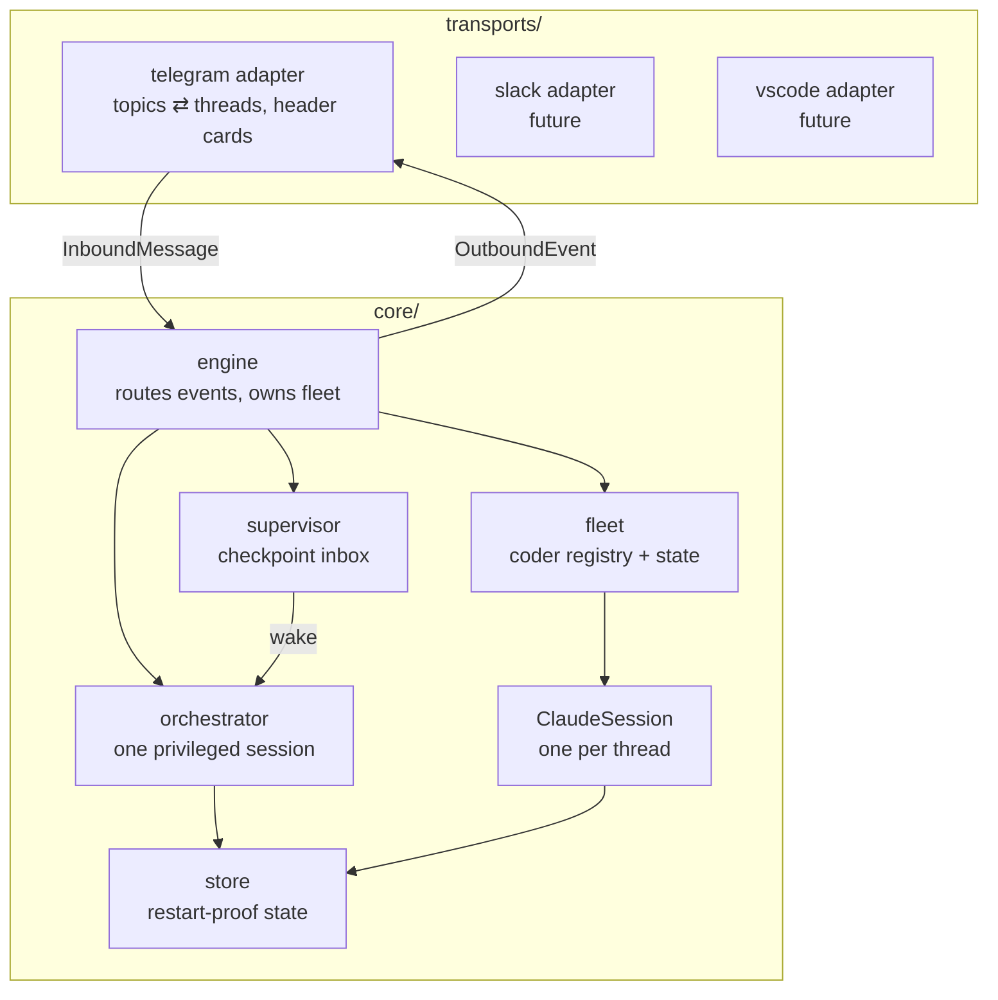
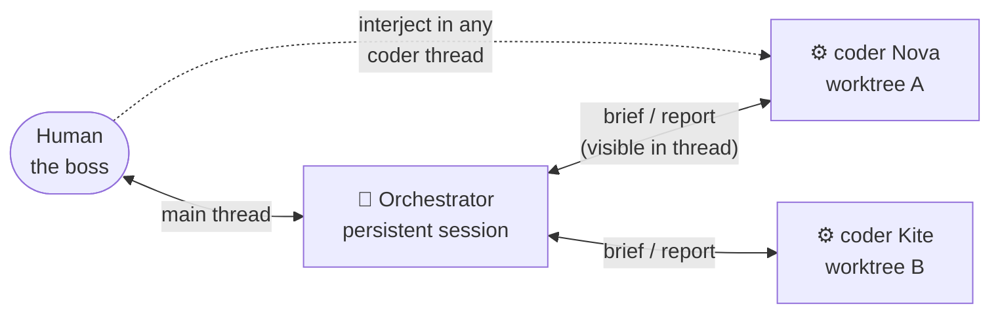

# Architecture

> Status: target architecture for the `orchestrator` branch. The pre-orchestrator
> design (direct sessions only) is described in the README and remains supported —
> the orchestrator is layered on top of it, not a replacement.

## Principles

1. **Transport-agnostic core.** Everything that matters — sessions, the
   orchestrator, the fleet, supervision — lives in `core/` and speaks in its own
   vocabulary (`Thread`, `Speaker`, `OutboundEvent`). It never imports a chat
   platform. Telegram is one adapter in `transports/`; Slack or a VSCode
   extension would be new adapters with zero core changes.
2. **Glass-walled delegation.** The orchestrator drives coder sessions, and every
   conversation happens in a visible thread. The human can watch any exchange and
   type into it as a third party — both agents see the interjection.
3. **One bot account, many identities.** Chat platforms bind one token to one
   sender, so speaker identity is rendered in the message (header card + thread
   name), not in the account. The core deals only in `Speaker` structs; how they
   render is the transport's job.
4. **Checkpoint supervision, not micro-management.** Coders get whole tasks and
   run autonomously (`bypassPermissions`). The orchestrator is woken at
   checkpoints — task finished, coder blocked, question asked, human interjected —
   never per token. Events come as SDK pushes, not polling.

## Layers

### The transport contract (`core/ports.py`)

A transport implements one small interface and receives one callback:

- `create_thread(title) -> thread_id` · `rename_thread` · `close_thread`
- `post(thread_id, speaker, content)` — content is text or media; the transport
  renders the speaker (headers, emojis, quoting) however fits the platform
- it calls `engine.on_inbound(InboundMessage)` for every human message

`Speaker` is `{role: orchestrator|coder|system, name, emoji}`. The core never
formats platform text; the adapter never holds session state.

## The org model

- **Main thread** (Telegram: the General topic) = the orchestrator's office. The
  human talks to the orchestrator here; fleet status lives here.
- **Coder thread** = one coder session + the orchestrator's side of that
  conversation. Everything either of them says is posted to the thread.
- **Interjection**: a human message in a coder thread is delivered to the coder
  as user input *and* recorded in the orchestrator's inbox, so both see it.
- The human can still run direct (orchestrator-less) sessions — the pre-existing
  `/new` flow is unchanged. The orchestrator is optional per thread.

## Session roles

| | orchestrator | coder | direct |
|---|---|---|---|
| Lifetime | persistent | per task | until `/kill` |
| cwd | none (fleet root) | git worktree of target repo | repo itself |
| Tools | fleet MCP tools (spawn/brief/status/…) | telegram media tools | telegram media tools |
| Speaks in | main thread + any coder thread | its own thread | its own thread |
| Supervised by | human | orchestrator (checkpoints) | human |

The orchestrator is itself a Claude session — its "powers" are MCP tools exposed
by the engine: `spawn_coder(repo, task, name?)`, `message_coder(id, text)`,
`coder_status(id?)`, `dismiss_coder(id)`, `report(text)`. Its system prompt
teaches briefing etiquette (from firstmate's practices: self-contained briefs,
explicit report-back markers, escalate-don't-guess).

## Supervision (checkpoint inbox)

The supervisor keeps an inbox per orchestrator. Producers:

- SDK events from coder sessions: turn ended (with result), error, question
  detected, budget/turn ceiling hit
- transport events: human interjection in a coder thread
- timers: a coder silent past its soft deadline

Benign events (tool chatter, streaming) are absorbed. Actionable events wake the
orchestrator with a digest turn: `[inbox] Nova: tests green, task complete` — the
orchestrator then decides: report to human, re-brief, dismiss, or spawn next.
This is firstmate's zero-token-idle idea with SDK pushes instead of tmux polling.

## Worktree isolation

Every coder gets `git worktree add <fleet>/worktrees/<coder>-<slug>` on a fresh
branch `coder/<slug>`. The repo's primary checkout is never touched; parallel
coders on one repo can't collide. Teardown removes merged/clean worktrees and
reports dirty ones instead of deleting them.

## State (restart-proof)

`state/` holds JSON: thread registry (thread ⇄ role ⇄ session_id ⇄ cwd/worktree),
fleet records (coder id, name, task brief, status log), orchestrator session id.
On restart: threads reattach lazily (`resume=` on next message), the supervisor
rebuilds its inbox from unfinished coder records.

## Delivery gates (later, optional)

Firstmate's `ship` vs `scout` distinction and PR-vs-local-merge modes are worth
adopting once the core loop is solid; they are explicitly out of scope for the
first implementation.
