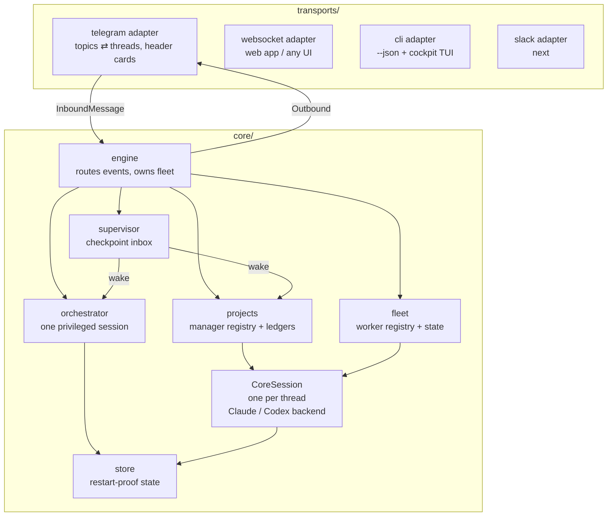
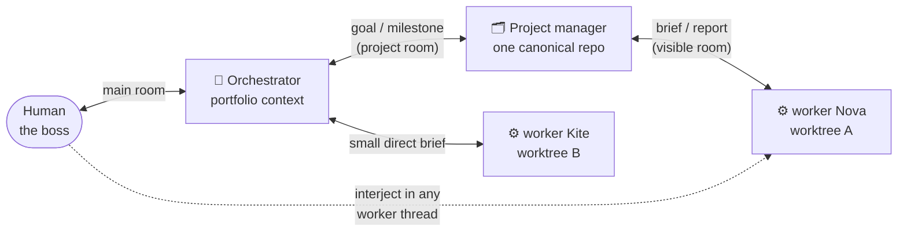

# Architecture

> The orchestrator is the default model. Direct (orchestrator-less) sessions via
> `/new` remain supported — they are layered underneath, not replaced.

## Principles

1. **Transport-agnostic core.** Everything that matters — sessions, the
   orchestrator, the fleet, supervision — lives in `core/` and speaks in its own
   vocabulary (`Thread`, `Speaker`, `Outbound`). It never imports a chat
   platform. Telegram and a WebSocket surface (the web app) are adapters in
   `transports/`; Slack would be another, with zero core changes.
2. **Glass-walled delegation.** The orchestrator drives worker sessions, and every
   conversation happens in a visible thread. The human can watch any exchange and
   type into it as a third party — both agents see the interjection.
3. **One bot account, many identities.** Chat platforms bind one token to one
   sender, so speaker identity is rendered in the message (header card + thread
   name), not in the account. The core deals only in `Speaker` structs; how they
   render is the transport's job.
4. **Checkpoint supervision, not micro-management.** Workers get whole tasks and
   run autonomously (`bypassPermissions`). Their supervisor is woken at
   checkpoints — task finished, worker blocked, question asked, human interjected —
   never per token. Events come as SDK pushes, not polling.
5. **Shallow, adaptive hierarchy.** A repo may have one project manager between
   the orchestrator and its workers. This isolates long-lived project context, but
   it is not a mandatory extra model hop: small or one-off tasks can still go
   straight from the orchestrator to a worker. The hierarchy never grows beyond
   orchestrator → project manager → worker.

## Layers

```mermaid
flowchart TB
    subgraph transports/
        TG[telegram adapter<br/>topics ⇄ threads, header cards]
        WS[websocket adapter<br/>web app / any UI]
        CLI[cli adapter<br/>--json + cockpit TUI]
        SLACK[slack adapter<br/>next]
    end
    subgraph core/
        ENG[engine<br/>routes events, owns fleet]
        ORC[orchestrator<br/>one privileged session]
        PROJECTS[projects<br/>manager registry + ledgers]
        FLEET[fleet<br/>worker registry + state]
        CS[CoreSession<br/>one per thread<br/>Claude / Codex backend]
        SUP[supervisor<br/>checkpoint inbox]
        ST[store<br/>restart-proof state]
    end
    TG -- InboundMessage --> ENG
    ENG -- Outbound --> TG
    ENG --> ORC & PROJECTS & FLEET & SUP
    PROJECTS --> CS
    FLEET --> CS
    SUP -- wake --> PROJECTS & ORC
    ORC & CS --> ST
```

### The transport contract (`core/ports.py`)

A transport implements one small interface and receives one callback:

- `create_thread(title) -> thread_id` · `close_thread`
- `post(thread_id, speaker, content)` — content is text or media; the transport
  renders the speaker (headers, emojis, quoting) however fits the platform
- it calls `engine.on_inbound(InboundMessage)` for every human message

`Speaker` is `{role: orchestrator|worker|system, name, emoji}`. The core never
formats platform text; the adapter never holds session state.

## The org model

```mermaid
flowchart LR
    H([Human<br/>the boss]) <-->|main room| O[🧭 Orchestrator<br/>portfolio context]
    O <-->|"goal / milestone<br/>(project room)"| PM[🗂️ Project manager<br/>one canonical repo]
    PM <-->|"brief / report<br/>(visible room)"| C1[⚙️ worker Nova<br/>worktree A]
    O <-->|"small direct brief"| C2[⚙️ worker Kite<br/>worktree B]
    H -.->|"interject in any<br/>worker thread"| C1
```

- **One orchestrator per deployment.** You reach it in the group's `general` thread
  or by DM (`dm:<user_id>`); both drive the *same* session, and it replies to
  whichever you used (a DM just keeps chatter out of #general). Not a security
  boundary — for an isolated context, run a separate deployment (own bot + group).
- **#general is a live dashboard** as well as a chat surface: a single pinned message
  rendered from the store in code (never by the LLM) and edited in place on every
  state change — the fleet at a glance.
- **One project manager per canonical repo.** Repo aliases and paths that resolve
  to the same checkout share a manager and durable project record. The manager's
  own resumable session holds the detailed repo context; its bounded stored summary
  keeps the orchestrator informed. The orchestrator retains cross-project
  priorities and the boss relationship.
- **Adaptive routing.** Multi-project and long-running work benefits from a
  project manager's isolated context. A small, sequential, or one-off task can use
  the existing orchestrator → worker route and avoid coordination overhead.
- **Project and worker rooms are glass-walled.** A project manager has a visible
  room, and every worker retains its own visible room. On a surface without nested
  rooms, project identity is carried in names and headers instead.
- **Interjection**: a human message in a worker thread is delivered to the worker
  as user input *and* recorded for its supervisor, so both see it. Project-level
  decisions can be made directly in the manager room; portfolio decisions stay in
  the main room.
- The human can still run direct (orchestrator-less) sessions — the pre-existing
  `/new` flow is unchanged. The orchestrator is optional per thread.

## Session roles

| | orchestrator | project manager | worker | direct |
|---|---|---|---|---|
| Logical lifetime | deployment | project | task | until `/kill` |
| Active process | persistent | only while handling a turn | while task is active | while session is active |
| Scope | all projects | one canonical repo | one worktree/task | repo itself |
| Tools | portfolio + fleet control | project-scoped worker control | chat media tools | chat media tools |
| Speaks in | main room + escalations | project room + its worker rooms | its own room | its own room |
| Supervised by | human | orchestrator | manager or orchestrator | human |

The orchestrator is itself a coding-agent session — its "powers" are MCP tools exposed
by the engine: `spawn_worker(repo, task)`, `message_worker(id, text)`,
`worker_status(id?)`, `dismiss_worker(id)` — plus `routing_status`, `inspect_repo`,
`review_worker`, `run_checks`, `deliver_worker`. `routing_status` exposes the effective
fast/balanced/deep model-and-effort map and persisted worker profiles so the
orchestrator can diagnose collapsed or unexpectedly expensive routing itself. Its system prompt
teaches briefing etiquette: self-contained briefs, explicit report-back markers,
escalate-don't-guess, and the code-quality bar it holds workers to.

A project manager is a narrower instance of the same session machinery. Its tool
scope is enforced by the engine: it can inspect and supervise only workers attached
to its canonical repo. It cannot land work. It can review, run checks, and request
delivery, but the orchestrator and the existing human authorization policy remain
the only route to `deliver_worker`. A manager also cannot hire another manager, so
delegation cannot grow into an unbounded tree.

Managers are persistent identities, not permanently resident processes. Once a
manager finishes a turn, its provider-native session ID and project record remain
in the store while its backend process is allowed to stop. The next project event
resumes it lazily. This lets the organisation remember many repos without keeping
one heavyweight coding-agent process alive per repo.

## Why the hierarchy is adaptive

The project layer targets a specific failure mode: one portfolio conversation
accumulating unrelated repo histories. It is not based on an assumption that more
agents always improve coding. Controlled evaluations find that coordination helps
when work decomposes cleanly, while sequential and tool-heavy work can lose
performance to communication overhead. Production guidance likewise treats
focused subagents as a context tool whose extra cost must earn its way. The direct
worker route is therefore part of the architecture, not a legacy exception. See
[Google's controlled scaling study](https://research.google/blog/towards-a-science-of-scaling-agent-systems-when-and-why-agent-systems-work/)
and [Anthropic's context-engineering guidance](https://www.anthropic.com/engineering/effective-context-engineering-for-ai-agents).

## Supervision (checkpoint inbox)

The engine keeps supervision inboxes. Producers are:

- worker turn ends (the result text, including the worker's STATUS line, and
  errors)
- a human interjection in a worker thread

Benign events (tool chatter, streaming) are absorbed. An attached worker wakes its
project manager with a coalesced digest; a directly managed worker wakes the
orchestrator as before. The manager escalates only decisions, blockers, material
milestones, and reviewed delivery requests. This keeps raw repo detail out of the
portfolio context. If a manager cannot resume, the engine re-surfaces the worker to
the orchestrator rather than losing the checkpoint. Idle managers cost no model
turns and hold no live backend process; supervision remains push-driven, never
polled.

## Worktree isolation

Every worker gets `git worktree add <fleet>/worktrees/<worker>-<slug>` on a fresh
branch `worker/<slug>`. The repo's primary checkout is never touched; parallel
workers on one repo can't collide. Teardown removes merged/clean worktrees and
reports dirty ones instead of deleting them.

## State (restart-proof)

`state/` holds JSON: thread registry (thread ⇄ role ⇄ provider-native session IDs ⇄
cwd/worktree), manager records (canonical repo, identity, charter, latest bounded
summary), fleet records (worker id, supervisor, task brief, status log), and the
active backend. On restart, threads reattach lazily using the selected provider's
native resume ID. Hibernated managers remain hibernated until an event needs them;
active or actionable project work is re-surfaced to the correct manager and then
to the orchestrator when escalation is required.

A backend change retains provider IDs and supplies a bounded visible-text hand-off;
the manager record, workspace, git, and fleet state are the recovery ground truth
because hidden model context and in-flight tool state are not portable. Rehydration
reconstructs actionable supervision from stored worker/project states rather than
silently forgetting a blocked or finished-but-not-landed task. Per-worker committed
work always survives on its branch.

## Delivery (landing a worker's branch)

Work never dead-ends on a branch. `review_worker` returns a worker's committed diff
plus which routes are available; `run_checks(worker_id, command)` actually runs the
repo's tests/build in the worker's worktree and returns the **real** exit code —
verification, not the worker's word. A project manager may collect that evidence
and request delivery, but only the orchestrator surfaces and invokes the delivery
route under the configured boss authorization policy.

How landing is **authorized** is set by `DEPLOY_BRAVENESS`:

- **`conservative`** — a two-step hard gate no injected agent can talk its way past:
  `deliver_worker(worker_id, method)` does **not** land anything; it records a pending
  request bound to the worker's current commit and posts a `🚦` prompt. Only an
  allowlisted human's **`/approve <worker>`** executes that exact revision; if the
  branch moves, it must be reviewed and requested again.
- **`balanced`** (the default) — a soft gate: `deliver_worker` lands immediately,
  trusting the orchestrator to call it only once the boss clearly said so. Convenient
  for solo/greenfield; an injected orchestrator that *believes* it was told to ship
  can land, which is the trade you opt into.

A worker whose `run_checks` last **failed** is refused in **both** modes — braveness
softens the *authorization* step, never correctness.

The two routes:

- **`merge`** — a deterministic local merge of `worker/<id>` into the repository's
  resolved **default branch**, which the worker forked from at spawn, *not* whatever
  happened to be checked out then. Refuses unless the primary checkout is on that
  default branch and clean,
  aborts + rolls back on conflict, never force-anything. The one irreversible step is
  boring, gated code — not the LLM freehanding git.
- **`pr`** — pushes the branch and opens a GitHub PR against the base branch
  (`gh pr create --base`). Non-destructive, so it's fine for the agent path;
  available only when a remote **and** an authenticated `gh` exist, else it degrades
  to a local merge.

The split is deliberate: **capability is detected** (`gh` auth presence decides
whether `pr` is available), **authorization policy is `DEPLOY_BRAVENESS`**. Deeper
policy (ship/scout task types, required reviewers) can layer on later; the core loop
verifies and lands work end to end.
